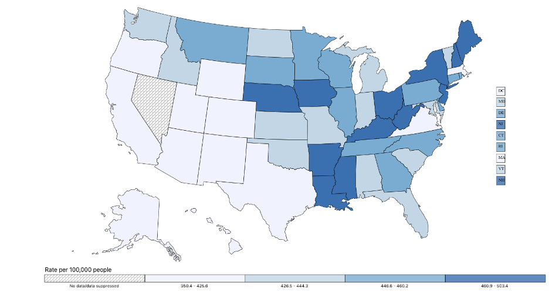

# Cancer Incidence and Mortality in New York's Counties

Interactive geovisualizations of New York state's cancer statistics made using Plotly
1. [How to use](#how-to)
2. [Abstract](#abstract)
3. [Introduction](#intro)
4. [Existing Visualizations](#existing-viz)
5. [Datasets & Methods](#methods)
6. [Results](#results)
7. [Conclusion](#conclusion)
8. [Future Work](#future-work)
9. [References & Acknowledgements](#references)

## 2. Abstract<a name="abstract"/>
Cancer is a leading cause of death in the state of New York. In 2018, the latest year for which Cancer incidence data is available, New York reported 114,373 new cases - 4th highest in the country [[1](#1)]. The incidence rate was 472.2 per 100,000 people - highest among the ten states with the most cases. An increased incidence rate points to increased exposure to cancer-causing risk factors. Analyzing geographical Cancer data helps to identify emerging Cancer clusters, understand community screening needs, and direct surveillance efforts. In this project, I explore geographical visualization techniques to better understand the impact of various Cancers on New York's counties. I use New York Department of Health's publicly available Cancer registry dataset to Geovisualize county-wise Cancer data. Using data visualization design principles, I improve upon existing cancer visualizations for the State of New York - and discuss the process here.

## 3. Introduction<a name="intro"/>
Cancer is a generic term used to cover a large group of diseases where abnormal cells multiply uncontrollably in a part of the human body. It is a leading cause of death in the US. Even in 2020, the number of deaths caused by Cancer exceeded that of Covid-19. However, these trends are improving consistently- death rates went from 200.8 per 100,000 in 1999 to 146.2 per 100,000 in 2019 [[2](#2)].

**Motivation**: A major contributing factor to this improvement is the usage of data visualization to identify patterns in screening, detection, and treatment of the disease. And there is tremendous scope of improvement as well - an estimated 42% of all cancer cases and nearly one-half of all cancer deaths in the United States were attributable to evaluated risk factors, many of which could have been mitigated by effective preventive strategies [[8](#8)].

Public health officials use Cancer incidence and mortality maps to identify areas in need of healthcare resources and guide surveillance and control activities. Quality of decision-making thus relies on accurate quantification of risks from observed rates which can be very unreliable when computed from sparsely populated geographical [[3](#3)]. Therefore, we picked NY as it has one of the highest cancer incidence and mortality.

These increased incidence rates could be attributed to risk factors such as smoking, Cancer-causing chemicals (carcinogens), obesity, hormones, chronic inflammation, radiation, viruses, and a lack of exercise [[4](#4)]. So, correlating county-wise incidence data with rates of the aforementioned risk factors could provide public health officials with valuable information on how to allocate resources to the affected populations. We use scatterplots to visualize the correlation between cancer incidence/mortality and these risk factors. We also quantify this correlation using Pearson’s correlation coefficient.

Cancer occurs in both males and females. However, there are stark differences in the pathogenesis, diagnosis, and prognosis of these cancers between males and females [[5](#5)]. We visualize cancer incidence and mortality data for both males and females to highlight these differences.

## 4. Existing Visualizations<a name="existing-viz"/>
### 4.1. CDC's national map depicting Cancer incidence
Figure 1((#figure-1)) shows a color-coded interactive map depicting the age-adjusted cancer incidence rate for every US state. Clicking on any state synchronously updates the bar graphs shown in Figure 2 and Figure 3, rendering the top 10 Cancer types for that state by incidence and mortality rates, respectively [[1](#1)].

Though the map is aesthetically pleasing and does well to represent the incidence and mortality rate at a national scale, there are ways in which it can be improved. Firstly, the labels are too small and can be enlarged for better viewing. Secondly, visualizing the incidence and mortality rate for specific types of cancers (instead of all cancers) could reveal insightful information about cancer clusters. Finally, even better would be to break this data further into counties; this could provide valuable guidance to public health officials on how to direct preventive and treatment efforts.

<h4 align="center" id="figure-1">Figure 1</h4>

|  |
|:--:|
| Cancer incidence rates for US states, 2018 (CDC) |

## 9. References & Acknowledgements<a name="references"/>
1.	https://gis.cdc.gov/Cancer/USCS/#/AtAGlance/<a name="1"/>
2.	https://www.cdc.gov/cancer/dcpc/research/update-on-cancer-deaths/index.htm<a name="2"/>
3.	Goovaerts, P. Geostatistical analysis of disease data: visualization and propagation of spatial uncertainty in cancer mortality risk using Poisson kriging and p-field simulation. Int J Health Geogr 5, 7 (2006). https://doi.org/10.1186/1476-072X-5-7<a name="3"/>
4.	https://www.mayoclinic.org/diseases-conditions/cancer/symptoms-causes/syc-20370588<a name="4"/>
5.	Cook, Michael B., et al. "Sex disparities in cancer mortality and survival." Cancer Epidemiology and Prevention Biomarkers 20.8 (2011): 1629-1637.<a name="5"/>
6.	https://www.health.ny.gov/statistics/cancer/registry/vol1.htm<a name="6"/>
7.	Michaels IH, Pirani SJ, Carrascal A. Visualizing 50 Years of Cancer Mortality Rates Across the US at Multiple Geographic Levels Using a Synchronized Map and Graph Animation. Prev Chronic Dis 2020;17:190286. http://dx.doi.org/10.5888/pcd17.190286<a name="7"/>
8.	Islami F, Goding Sauer A, Miller KD, Siegel RL, Fedewa SA, Jacobs EJ, et al. . Proportion and number of cancer cases and deaths attributable to potentially modifiable risk factors in the United States. CA Cancer J Clin . 2018;68(1):31–54.<a name="8"/>
9.	Chit Ming Wong, Hilda Tsang, et al. Cancer Mortality Risks from Long-term Exposure to Ambient Fine Particle, Cancer Epidemiol Biomarkers Prev May 1, 2016 (25) (5) 839-845; DOI: 10.1158/1055-9965.EPI-15-0626<a name="9"/>
10.	Keum N, Greenwood DC, Lee DH, et al. Adult weight gain and adiposity-related cancers: a dose-response meta-analysis of prospective observational studies. Journal of the National Cancer Institute 2015; 107(2). pii: djv088.<a name="10"/>
11.	US Department of Health and Human Services. The Health Consequences of Smoking—50 Years of Progress: A Report of the Surgeon General. Atlanta: US Department of Health and Human Services, Centers for Disease Control and Prevention, National Center for Chronic Disease Prevention and Health Promotion, Office on Smoking and Health, 2014 [2021 March 23].<a name="11"/>
12.	https://www.census.gov/geographies/mapping-files/time-series/geo/carto-boundary-file.html<a name="12"/>
