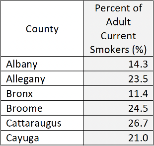

# Cancer Incidence and Mortality in New York's Counties

Interactive geovisualizations of New York state's cancer statistics made using Plotly
1. [How to use](#how-to)
2. [Abstract](#abstract)
3. [Introduction](#intro)
4. [Existing Visualizations](#existing-viz)
5. [Contribution](#contribution)
6. [Datasets & Methods](#methods)
7. [Results](#results)
8. [Conclusion](#conclusion)
9. [Future Work](#future-work)
10. [References & Acknowledgements](#references)

## 1. How to use<a name="how-to"/>
//TODO

## 2. Abstract<a name="abstract"/>
Cancer is a leading cause of death in the state of New York. In 2018, the latest year for which Cancer incidence data is available, New York reported 114,373 new cases - 4th highest in the country [[1](#1)]. The incidence rate was 472.2 per 100,000 people - highest among the ten states with the most cases. An increased incidence rate points to increased exposure to cancer-causing risk factors. Analyzing geographical Cancer data helps to identify emerging Cancer clusters, understand community screening needs, and direct surveillance efforts. In this project, I explore geographical visualization techniques to better understand the impact of various Cancers on New York's counties. I use New York Department of Health's publicly available Cancer registry dataset to Geovisualize county-wise Cancer data. Using data visualization design principles, I improve upon existing cancer visualizations for the State of New York - and discuss the process here.

## 3. Introduction<a name="intro"/>
Cancer is a generic term used to cover a large group of diseases where abnormal cells multiply uncontrollably in a part of the human body. It is a leading cause of death in the US. Even in 2020, the number of deaths caused by Cancer exceeded that of Covid-19. However, these trends are improving consistently- death rates went from 200.8 per 100,000 in 1999 to 146.2 per 100,000 in 2019 [[2](#2)].

**Motivation**: A major contributing factor to this improvement is the usage of data visualization to identify patterns in screening, detection, and treatment of the disease. And there is tremendous scope of improvement as well - an estimated 42% of all cancer cases and nearly one-half of all cancer deaths in the United States were attributable to evaluated risk factors, many of which could have been mitigated by effective preventive strategies [[8](#8)].

Public health officials use Cancer incidence and mortality maps to identify areas in need of healthcare resources and guide surveillance and control activities. Quality of decision-making thus relies on accurate quantification of risks from observed rates which can be very unreliable when computed from sparsely populated geographical [[3](#3)]. Therefore, I picked NY as it has one of the highest cancer incidence and mortality.

These increased incidence rates could be attributed to risk factors such as smoking, Cancer-causing chemicals (carcinogens), obesity, hormones, chronic inflammation, radiation, viruses, and a lack of exercise [[4](#4)]. So, correlating county-wise incidence data with rates of the aforementioned risk factors could provide public health officials with valuable information on how to allocate resources to the affected populations. I use scatterplots to visualize the correlation between cancer incidence/mortality and these risk factors. I also quantify this correlation using Pearson’s correlation coefficient.

Cancer occurs in both males and females. However, there are stark differences in the pathogenesis, diagnosis, and prognosis of these cancers between males and females [[5](#5)]. I visualize cancer incidence and mortality data for both males and females to highlight these differences.

## 4. Existing Visualizations<a name="existing-viz"/>

### 4.1. CDC's national map depicting Cancer incidence

[Figure 1](#figure-1) shows a color-coded interactive map depicting the age-adjusted cancer incidence rate for every US state. Clicking on any state synchronously updates the bar graphs shown in [Figure 2](#figure-2) and [Figure 3](#figure-3), rendering the top 10 Cancer types for that state by incidence and mortality rates, respectively [[1](#1)].

Though the map is aesthetically pleasing and does well to represent the incidence and mortality rate at a national scale, there are ways in which it can be improved. Firstly, the labels are too small and can be enlarged for better viewing. Secondly, visualizing the incidence and mortality rate for specific types of cancers (instead of all cancers) could reveal insightful information about cancer clusters. Finally, even better would be to break this data further into counties; this could provide valuable guidance to public health officials on how to direct preventive and treatment efforts.

<h4 align="center" id="figure-1">Figure 1</h4>

|  |
|:--:|
| Cancer incidence rates for US states, 2018 (CDC) |

<h4 align="center" id="figure-2">Figure 2</h4>

|  |
|:--:|
| Top 10 Cancers with highest incidence rate, 2018 (CDC) |

<h4 align="center" id="figure-3">Figure 3</h4>

|  |
|:--:|
| Top 10 Cancers with highest mortality rate, 2018, 2018 (CDC) |

### 4.2. Interactive county-map of New York

[Figure 4](#figure-4) shows a Cancer Visualization map from New York State Department of Health's website [[6](#6)]. It is an interactive synchronized map. Clicking inside a county within the Map opens up a new HTML page with that county's Cancer Incidence and mortality data. Unfortunately, the color-coding of the visualization is poor, it is not colorblind-friendly, and most importantly, it does not display any information about the data it is representing. This visualization could be made much better by representing the mortality/incidence rates on the Map using a visually appealing color-coding scheme (Python's Viridis, for example).

<h4 align="center" id="figure-4">Figure 4</h4>

|  |
|:--:|
| NY State Department of Health's Cancer Visualization Map |

### 4.3. Synchronized map showing yearly changes in Cancer mortality rates

[Figure 5](#figure-5) shows a synchronized map with graph animation [[7](#7)]. It displays changes over time in yearly, age-adjusted Cancer mortality rates at the county levels for the United States from 1968 through 2017. The visualization is aesthetically pleasing but inaccessible as the bars on the left are too small, and the labels are tough to read. Furthermore, it only displays the total Cancer mortality rates across counties. This visualization could be much more helpful if it would display mortality or, even better, incidence rates of specific Cancer types across counties.

<h4 align="center" id="figure-5">Figure 5</h4>

|  |
|:--:|
| Synchronized US County Map showing Cancer Mortality Rate (CDC) |

## 5. Contribution<a name="contribution"/>

I made the following novel contributions to the existing visualizations by exploring thematic mapping methods (specifically Choropleth and Bubble maps):
- CDC’s national cancer incidence map (Figure 1) depicts cancer incidence rates at a macro level. We use New York state’s GeoJSON file to create a county map to display cancer incidence rates at the county level which is a more useful visualization as it offers healthcare policy makers a better understanding of the distribution of cancer cases across the state.

- We also map different kinds of cancers and reveal the difference in distribution of various cancers across New York’s counties

- The label size was also an issue with the visualization, we adjusted the label size to make it better for viewing.

- New York State Department of Health's cancer visualization map (Figure 4) uses a discrete color scale to represent cancer cases across New York’s counties. These colors don’t not reveal any information about the underlying cancer data. We analyzed various color scales and chose the ones that best fit the data. 

- During analyses, we further discovered that representing total incidence/mortality numbers on a bubble map revealed more information about the geographical distribution as compared to representing the same data on choropleths.
 
- The synchronized map showing cancer mortality rates (Figure 5) has the issue of small label size, and it only represents mortality rates for cancer as a whole. We’ve purposefully created our visualizations for different kinds of cancers. We’ve also corrected the label size to make the visualizations more accessible to the viewer.

- Apart from visualizing Cancer data, we also evaluate its correlation with associated risk factors by computing their Pearson correlation coefficient. We also visualize these correlations on a Scatter plot.

- Taking inspiration from CDC’s visualizations (Figure 2 and Figure 3), we create Bar graphs for the top 10 cancers according to incidence and mortality rates. But here, we go a few steps further – 1. We visualize it for males and females separately, and 2. We do this not only for rates, but for total numbers as well.

## 6. Datasets and Methods<a name="methods"/>

### 6.1. Phase 1: Data cleaning

I use the following publicly available datasets for our visualizations:

### 6.1.1. New York State Department of Health, New York State Cancer Registry Cancer Incidence and Mortality by County and Gender, 2014-2018

Figure 6a is a snapshot from a comprehensive dataset that includes age-adjusted Cancer incidence and mortality rates by county and gender. 
- Column headings in this table have subheadings and those subheadings have another layer of subheadings. To extract data efficiently, we clean the tables so that it only has a single row of column headers and a single column of row indexes.
- The data in its raw form is in excel format. We decide to use Python’s pandas library to work with our data. So, we convert the excel dataset to a pandas dataframe.
- We use Tidy Data principles to clean up the dataframe so that we could retrieve data efficiently during the process of plotting visualizations.
- The major hurdle is that the dataset is huge and has a variety of data types within one table – we decide to break up the dataset into multiple dataframes based on Cancer Types, and store all these dataframes in a dictionary for fast retrieval.
- Figure 6b shows the final cleaned version of the dataset as a pandas dataframe.

<h4 align="center" id="figure-6a">Figure 6a</h4>

|  |
|:--:|
| Dataset #1: County-wise Cancer incidence and Mortality Data (New York State Department of Health) |

<h4 align="center" id="figure-6b">Figure 6b</h4>

|  |
|:--:|
| Clean Dataset #1: County-wise Cancer incidence and Mortality Data for each type of Cancer (this specific dataframe is corresponding to ‘All Invasive Malignant Tumors’ |

### 6.1.2. United States Environmental Protection Agency Air Quality Index Report

Dataset #2, shown in Figure 7a, includes Air Quality Index data by counties in New York. For each county, it lists the number of days the AQI was Good, Moderate, Unhealthy for Sensitive Groups, Unhealthy, and Very Unhealthy. It also lists the highest daily AQI value in the year, its 90th percentile value, and its median. Air Pollution is not only linked with Lung Cancer, but it's been shown to increase the risk of mortality for several other types of Cancer [9].

<h4 align="center" id="figure-7a">Figure 7a</h4>

|  |
|:--:|
| Clean Dataset #1: County-wise Cancer incidence and Mortality Data for each type of Cancer (this specific dataframe is corresponding to ‘All Invasive Malignant Tumors’ |

Many columns in this dataset are mostly empty, so we clean the dataset by removing columns with nan values. After working with pandas in the cancer dataset, we decide to store all our datasets in pandas dataframes because of the plethora of inbuilt functionalities it offers.

Figure 7b shows the cleaned version of this dataset.

<h4 align="center" id="figure-7b">Figure 7b</h4>

|  |
|:--:|
| Clean Dataset #2: County-wise Air Quality Index |

### 6.1.3. New York State Department of Health, Prevalence of Obesity among New York State Adults by County, BRFSS 2018

Dataset #3, shown in Figure 8a, includes the prevalence of obesity among adults by counties in New York. A population-based study using BMI and Cancer incidence data from the GLOBOCAN project estimated that, in 2012 in the United States, about 28,000 new cases of cancer in men (3.5%) and 72,000 in women (9.5%) were due to overweight or obesity [10].

This dataset doesn’t require much cleaning. We rename the column ‘Percent of adults who\nhave obesity (%)’ to ‘ObesityPercentage’ and store the data in a pandas dataframe. Figure 8b shows the cleaned version.

<h4 align="center" id="figure-8a">Figure 8a</h4>

|  |
|:--:|
| Dataset #3: County-wise Obesity data (New York State Department of Health) |

<h4 align="center" id="figure-8b">Figure 8b</h4>

|  |
|:--:|
|Clean dataset #3: County-wise Obesity data (New York State Department of Health) |

### 6.1.4. New York State Department of Health, Prevalence of Current Smoking Among Adults in New York by County NYS BRFSS 2016

Dataset #4, shown in Figure 9a, includes the prevalence of Adult smokers by counties in New York. Doctors have known for years that smoking causes most lung Cancers. It is still true today when nearly 9 out of 10 lung Cancers deaths are caused by smoking cigarettes or secondhand smoke exposure [11]. In addition, cigarette smoke contains many carcinogens that can cause Cancers almost anywhere in the body.

This dataset doesn’t require much cleaning either. We rename the column ‘Percent of Adult Current\nSmokers (%)’ to ‘SmokingPercentage’ and store the data in a pandas dataframe. Figure 9b shows the cleaned version.

<h4 align="center" id="figure-9a">Figure 9a</h4>

|  |
|:--:|
| Dataset #4: County-wise Smoker data (New York State Department of Health) |

<h4 align="center" id="figure-9b">Figure 9b</h4>

|  |
|:--:|
| Dataset #4: Clean dataset #4: County-wise Smoker data |

### 6.1.5. United States Census Bureau, Cartographic Boundary Files – Shapefile (2018)

We use GeoJSON file (converted from shapefiles) for US Counties from the United States Census Bureau’s publicly available Cartographic Boundary files. [12]

This JSON file contained GeoJSON data for counties all across the USA. We cleaned the data by removing information about counties of all states except that of New York.

We use GeoJSON file (converted from shapefiles) for US Counties from the United States Census Bureau’s publicly available Cartographic Boundary files. [12]

This JSON file contained GeoJSON data for counties all across the USA. We cleaned the data by removing information about counties of all states except that of New York.

### 6.2. Phase 2: Initial Visualizations

My goal here is to reprise visualizations discussed in the [Existing Visualizations](#existing-viz) section. We explored Altair’s python library and Plotly Express’ python library, finally settling on Plotly Express as it offers easy to use methods to create interactive visualizations

### 6.2.1 Choropleth

Figure 10a. shows one of the first Choropleths we created by using Plotly’s default settings. Even though we were impressed by the ease with which we could create an interactive plot using Plotly, there were a number of key areas that needed addressing.

- The number of new cancer cases varies greatly across New York’s counties. On one hand, the county of New York has over 40,000 new cancer cases every year, and on the other hand a county like Yates has just 169 new cancer cases. Using a default continuous color scale in Plotly fails to show the distribution of total cases in indicators which have such a high difference between the maximum and minimum quantity.

- We tried using a variety of different color scales, like the one in figure 10b., which corresponds to the color scale – ‘Matter’. It does look better than fig 10a., but it still fails to reveal differences in the number of cancer cases across most of New York’s counties.

- So, we decided not to use Choropleth for total incidence number, and rather try it on incidence rates instead. And the results were pleasing – when the difference between max and min value is not large, choropleths worked wonderfully. Figure 10c. shows one of our first visualizations using incidence rate data using Plotly’s default settings.

<h4 align="center" id="figure-10a">Figure 10a</h4>

|  |
|:--:|
| Initial Choropleth plot for total incidence of cancer cases across all counties in New York |

<h4 align="center" id="figure-10b">Figure 10b</h4>

|  |
|:--:|
| Total incidence choropleth with color scale = ‘Matter’ |

<h4 align="center" id="figure-10c">Figure 10c</h4>

|  |
|:--:|
| Incidence rate choropleth with default color scale |

### 6.2.2 Bubble Map

We decided to try out Bubble maps for the total incidence numbers as choropleths were not a good choice for it. Figure 11a. shows one of the first Bubble plots that we created for incidence data using Plotly’s default settings. Though there was a lot of scope for improvement, the bubble map conveys much more information about the distribution of total cancer cases when compared to choropleth.

- We realized that we were using Plotly’s default map projection, and that was distorting the areas of the New York’s counties. We decided to use an equal area map projection for all our future plots using thematic mapping methods. We finally set it to Eckert IV. Figure 11b shows one of our first Bubble plots using Eckert IV and a better bubble size.

- We observed that the bubbles were not clearly visible for the regions with low quantities, so we decided to increase the sizes of the bubbles. Figure 11c shows the bubble plot with an increased bubble size.

- Comparing the results with the choropleths for total incidence numbers, we decided to use bubble maps for it.

<h4 align="center" id="figure-11a">Figure 11a</h4>

|  |
|:--:|
| Incidence rate bubble map with default Plotly settings |

<h4 align="center" id="figure-11b">Figure 11b</h4>

|  |
|:--:|
| Incidence rate bubble map with equal area map Projection |

<h4 align="center" id="figure-11c">Figure 11c</h4>

|  |
|:--:|
| Incidence rate bubble map with max bubble size=60 |

### 6.2.3 Scatter Plots

To find if cancers have correlations with common risk factors, we used pearsonr method from scipy.stats module to calculate the Pearson correlation coefficient

Even though we were able to compute the correlation coefficients for a variety of cancers and their associated risk factors, we realized that visualizing through a scatterplot would convey this information in a better way.

- Figure 12 shows our initial scatterplot visualization with Colorectal cancer's incidence rate on the Y axis and adult obesity percentage on the X axis.
- The figure shows a clear correlation between the X and Y axes. We decided to visualize all correlations using scatterplots – which convey information in a clear and simple way.

<h4 align="center" id="figure-12">Figure 12</h4>

|  |
|:--:|
| Colorectal cancer’s incidence rate versus adult obesity percentage (default Scatterplot) |

### 6.2.4 Bar Graphs

To reprise CDC’s bar graphs representing cancers with the highest mortality and incidence rates, we decided to use Plotly’s inbuilt bar function.

- Figure 13 shows one of the first bar graph visualizations that we created. There are still improvements to be made to make it look impactful, but we can clearly see the distribution of cancer cases across the top 10 cancers according to incidence and mortality rate.
- As a result, we decided to use bar graphs to visualize top 10 cancers according to incidence and mortality rates for both males and females.

The improvements and the visualizations that we created are discussed in the next section.

<h4 align="center" id="figure-13">Figure 13</h4>

|  |
|:--:|
| Bar Graph showing the top 10 Cancers according to incidence and mortality numbers |

## 7. Results<a name="results"/>

### 7.1.1. Visualize Cancer Data through Choropleth and Bubble Maps

#### a. Incidence rates

Incidence rate refers to the rate of new cases of cancer diagnosed each year. The following 3 plots show the incidence rate of new cancer cases per 100,000 people across New York’s counties from 2014 to 2018.

## 10. References & Acknowledgements<a name="references"/>
1.	https://gis.cdc.gov/Cancer/USCS/#/AtAGlance/<a name="1"/>
2.	https://www.cdc.gov/cancer/dcpc/research/update-on-cancer-deaths/index.htm<a name="2"/>
3.	Goovaerts, P. Geostatistical analysis of disease data: visualization and propagation of spatial uncertainty in cancer mortality risk using Poisson kriging and p-field simulation. Int J Health Geogr 5, 7 (2006). https://doi.org/10.1186/1476-072X-5-7<a name="3"/>
4.	https://www.mayoclinic.org/diseases-conditions/cancer/symptoms-causes/syc-20370588<a name="4"/>
5.	Cook, Michael B., et al. "Sex disparities in cancer mortality and survival." Cancer Epidemiology and Prevention Biomarkers 20.8 (2011): 1629-1637.<a name="5"/>
6.	https://www.health.ny.gov/statistics/cancer/registry/vol1.htm<a name="6"/>
7.	Michaels IH, Pirani SJ, Carrascal A. Visualizing 50 Years of Cancer Mortality Rates Across the US at Multiple Geographic Levels Using a Synchronized Map and Graph Animation. Prev Chronic Dis 2020;17:190286. http://dx.doi.org/10.5888/pcd17.190286<a name="7"/>
8.	Islami F, Goding Sauer A, Miller KD, Siegel RL, Fedewa SA, Jacobs EJ, et al. . Proportion and number of cancer cases and deaths attributable to potentially modifiable risk factors in the United States. CA Cancer J Clin . 2018;68(1):31–54.<a name="8"/>
9.	Chit Ming Wong, Hilda Tsang, et al. Cancer Mortality Risks from Long-term Exposure to Ambient Fine Particle, Cancer Epidemiol Biomarkers Prev May 1, 2016 (25) (5) 839-845; DOI: 10.1158/1055-9965.EPI-15-0626<a name="9"/>
10.	Keum N, Greenwood DC, Lee DH, et al. Adult weight gain and adiposity-related cancers: a dose-response meta-analysis of prospective observational studies. Journal of the National Cancer Institute 2015; 107(2). pii: djv088.<a name="10"/>
11.	US Department of Health and Human Services. The Health Consequences of Smoking—50 Years of Progress: A Report of the Surgeon General. Atlanta: US Department of Health and Human Services, Centers for Disease Control and Prevention, National Center for Chronic Disease Prevention and Health Promotion, Office on Smoking and Health, 2014 [2021 March 23].<a name="11"/>
12.	https://www.census.gov/geographies/mapping-files/time-series/geo/carto-boundary-file.html<a name="12"/>
